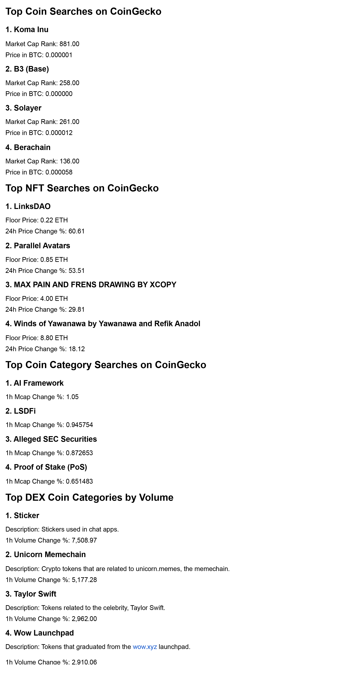

# Crypto Trends via Email Notifications

## Overview

This project fetches trending cryptocurrency data from the CoinGecko API, processes it, and sends periodic email notifications with key insights. It provides updates on trending coin searches, NFT activity, and on-chain categories, helping users stay informed about market trends.

## Features

- Fetches trending cryptocurrencies, NFTs, and on-chain categories from CoinGecko.
- Formats the data into structured HTML reports.
- Sends periodic email notifications with market insights.
- Allows customization of notification frequency.

## Installation

1. Clone the repository: `git clone`
2. Create venv `python -m venv env && env/scripts activate`
3. Install requirements `pip install -r requiremenents.txt`
4. Rename `.env.example` to `.env`
5. Add your CoinGecko API Key.
6. Generate a Google App password for your account [here](https://myaccount.google.com/apppasswords)

### Example

